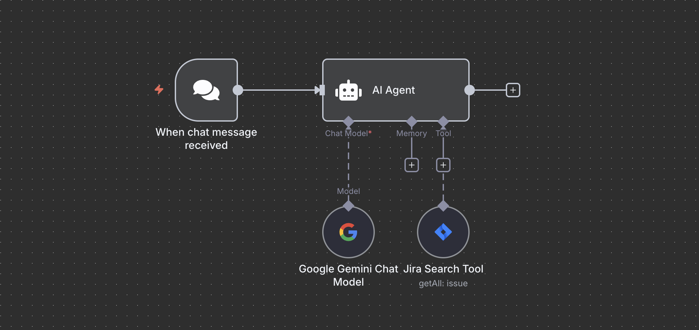

# Workflow Overview

# Enterprise Search Assistant – n8n Workflow

This n8n workflow provides an AI-powered Enterprise Search Assistant specialized in Jira ticket analysis and enterprise knowledge retrieval. It is designed to help users find accurate information from Jira and deliver actionable insights, but can be easily extended to include other enterprise data sources such as SharePoint, Confluence, or custom databases.

---

## Features

- **Jira Integration:**
  - Searches Jira tickets using dynamically generated JQL queries based on user requests.
  - Retrieves ticket details, project status, issue patterns, and more.
  - Handles queries for personal assignments using `currentUser()`.
- **AI-Powered Analysis:**
  - Uses Google Gemini LLM to interpret user queries, generate JQL, and provide detailed, context-aware responses.
  - Summarizes search results, highlights key findings, and offers recommendations.
- **Structured Responses:**
  - Every answer includes a search summary, key findings, detailed analysis, and recommendations.
- **Error Handling:**
  - Suggests alternative search strategies if no results are found or if queries are ambiguous.
- **Extensible Architecture:**
  - Easily add more connectors (e.g., SharePoint, Confluence, databases) to expand enterprise search capabilities.

---

## Workflow Overview

1. **Trigger:**
   - Listens for incoming chat messages (e.g., from a chatbot or web interface).
2. **AI Agent:**
   - Receives the user query and system context.
   - Generates appropriate JQL queries and search strategies.
   - Calls the Jira Search Tool to retrieve ticket data.
   - Analyzes and summarizes results using Google Gemini LLM.
3. **Jira Search Tool:**
   - Executes JQL queries and returns relevant ticket fields.
4. **Google Gemini Chat Model:**
   - Provides LLM-powered language understanding and response generation.

---

## Node Summary

- **When chat message received:** Triggers the workflow on new chat input.
- **AI Agent:** Orchestrates the search, analysis, and response logic.
- **Jira Search Tool:** Performs JQL-based searches in Jira.
- **Google Gemini Chat Model:** Supplies LLM capabilities for query understanding and response generation.

---

## Setup Instructions

1. **Credentials:**
   - Configure Jira and Google Gemini credentials in n8n.
2. **Jira Project Access:**
   - Ensure the connected Jira account has access to relevant projects and tickets.
3. **Activate Workflow:**
   - Enable the workflow in n8n to start handling enterprise search queries.

---

## Extending the Workflow

This workflow is designed to be extensible. You can add more connectors to search across other enterprise data sources, such as:

- **SharePoint:** Integrate with SharePoint to search documents, sites, and lists.
- **Confluence:** Add Confluence integration for wiki and documentation search.
- **Databases:** Connect to SQL/NoSQL databases for structured data retrieval.
- **Custom APIs:** Integrate any RESTful API for additional data sources.

To extend, simply add new nodes for your data source, connect them to the AI Agent, and update the system prompt to describe the new capabilities.

---

## Example Use Cases

- Find all high-priority bugs in a specific Jira project.
- List all tickets assigned to the current user.
- Analyze recent activity or trends in project issues.
- Retrieve documentation or files from SharePoint (with connector added).

---

## Best Practices

- Keep your Jira and other data source credentials secure and up to date.
- Regularly review and refine the AI Agent's system prompt for optimal results.
- Monitor workflow logs for errors or opportunities to improve search strategies.

---

## License

This workflow is provided as-is. Adapt and extend as needed for your organization.
