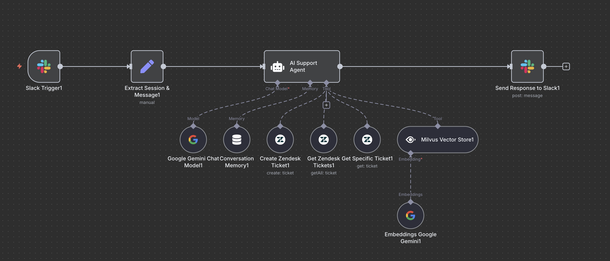

# Workflow Overview

# Slack AI Support Agent – n8n Workflow

This n8n workflow integrates Slack, Zendesk, and a company knowledge base (via Milvus) to provide an intelligent AI-powered support agent for Slack channels. It leverages Google Gemini for LLM and embeddings, and follows a structured support and escalation process.

---

## Features

- **Slack Integration:** Listens for `@app_mention` events in a specified Slack channel and responds with AI-generated support answers.
- **Knowledge Base Search:** Uses Milvus vector store and Gemini embeddings to search the company knowledge base for relevant solutions before troubleshooting.
- **AI-Powered Responses:** Utilizes Google Gemini LLM to analyze user queries, conversation context, and knowledge base results to generate helpful, context-aware responses.
- **Zendesk Integration:**
  - **Create Ticket:** Escalates to Zendesk only after troubleshooting steps are exhausted or upon explicit user request.
  - **Get Recent Tickets:** Retrieves the latest Zendesk tickets for user status queries.
  - **Get Ticket by ID:** Fetches details for a specific Zendesk ticket when requested.
- **Conversation Memory:** Maintains context across user interactions for more coherent and helpful support.

---

## Workflow Overview

1. **Trigger:**
   - Listens for `@app_mention` events in a designated Slack channel.
2. **Session & Message Extraction:**
   - Extracts session ID, user ID, channel ID, and cleans up the message text.
3. **AI Support Agent:**
   - Receives the cleaned message and context.
   - **Step 1:** Searches the knowledge base (Milvus) for relevant answers.
   - **Step 2:** If KB answer is found, responds with it (citing the source). If not, proceeds to troubleshooting.
   - **Step 3:** If troubleshooting fails or user requests, creates a Zendesk ticket.
   - **Step 4:** Can fetch recent tickets or ticket details on user request.
   - **Step 5:** Sends the AI-generated response back to Slack.

---

## Node Summary

- **Slack Trigger:** Listens for mentions in a specific channel.
- **Set:** Extracts and formats session/message data.
- **AI Support Agent:** Orchestrates the support logic, using:
  - **Google Gemini Chat Model** (LLM)
  - **Conversation Memory**
  - **Milvus Vector Store** (KB search)
  - **Google Gemini Embeddings**
  - **Zendesk Tool** (create/get tickets)
- **Send Response to Slack:** Posts the final response back to the channel.

---

## Setup Instructions

1. **Credentials:**
   - Configure Slack, Zendesk, Google Gemini, and Milvus credentials in n8n.
2. **Channel & Collection:**
   - Update the Slack channel ID and Milvus collection name as needed.
3. **Knowledge Base:**
   - Ensure your knowledge base is indexed in Milvus and accessible.
4. **Activate Workflow:**
   - Enable the workflow in n8n for real-time support.

---

## Customization

- **Prompt/Instructions:**
  - The system prompt for the AI agent can be customized for your support philosophy, escalation rules, and troubleshooting steps.
- **Node Parameters:**
  - Adjust the number of tickets fetched, KB search top-K, or LLM temperature as needed.

---

## Example Use Cases

- **User asks a question in Slack:**
  - The agent searches the KB and responds with a solution or troubleshooting steps.
- **User requests ticket creation:**
  - After troubleshooting, the agent creates a Zendesk ticket and confirms in Slack.
- **User asks about ticket status:**
  - The agent fetches and reports the status from Zendesk.

---

## Best Practices

- Always keep your knowledge base up to date for best results.
- Review and refine the AI prompt to match your support workflow.
- Monitor escalations to Zendesk to ensure proper handoff.

---

## License

This workflow is provided as-is. Adapt and extend as needed for your organization.
