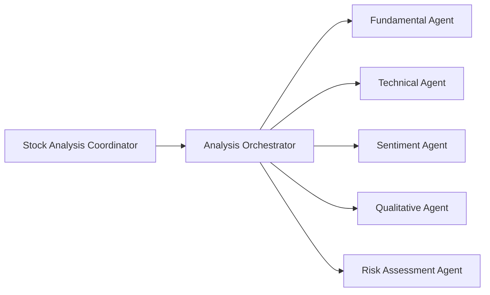

# Stock Analysis Agent

## Overview

The Stock Analysis Agent is a comprehensive AI-powered financial analysis system that provides in-depth stock market analysis through specialized sub-agents. Each sub-agent focuses on a specific aspect of stock analysis to deliver thorough and well-rounded investment insights.

## Demo

<p align="center">
  
</p>

## Agent Details

| Attribute | Detail |
|---|---|
| Interaction Type | Conversational |
| Complexity | Medium |
| Agent Type | Multi Agent |
| Components | Sub-agents with specialized analysis capabilities |
| Vertical | Financial Services |

### Agent Architecture

The Stock Analysis Agent uses a hierarchical multi-agent architecture:

- **Stock Analysis Coordinator**: The root agent that orchestrates the entire analysis process by delegating tasks to the Analysis Orchestrator.
- **Analysis Orchestrator**: Coordinates all specialized sub-agents and synthesizes their outputs into a comprehensive investment report.
- **Sub-Agents**: Each sub-agent is responsible for a specific domain of analysis (technical, fundamental, sentiment, qualitative, risk).



## Tools and APIs Used

Each sub-agent leverages specific tools to perform its analysis:

| Sub-Agent                | Tools Used         | Description |
|--------------------------|-------------------|-------------|
| Fundamental Agent        | Google Search     | Retrieves financial statements, earnings, and company news for analysis. |
| Technical Agent          | Google Search     | Gathers price data, charts, and technical indicators. |
| Sentiment Agent          | Google Search     | Collects news, analyst opinions, and social sentiment. |
| Qualitative Agent        | Google Search     | Finds information on management, business model, and competitive landscape. |
| Risk Assessment Agent    | Google Search     | Identifies and quantifies risk factors from market and company data. |
| Analysis Orchestrator    | AgentTool         | Synthesizes outputs from all sub-agents. |
| Stock Analysis Coordinator | AgentTool       | Orchestrates the overall workflow. |

All sub-agents use the `gemini-2.5-pro-preview-05-06` model for LLM-based reasoning.

## Key Features

- Modular, multi-agent design for comprehensive stock analysis
- Each sub-agent specializes in a distinct analysis domain
- Uses Google Search for real-time data gathering
- Produces institutional-grade investment reports

## Setup and Installation

### Prerequisites

- Python 3.12+
- Poetry for dependency management and packaging
  - See the official [Poetry website](https://python-poetry.org/docs/) for more information. To install Poetry run:
  ```bash
  pip install poetry
  ```
- Google Cloud Project with the following roles assigned:
  - Vertex AI User
  - Storage Admin
  - Service Usage Consumer
  - Logs Viewer

Once you have created your project, [install the Google Cloud SDK](https://cloud.google.com/sdk/docs/install). Then run the following command to authenticate:
```bash
gcloud auth login
```

You also need to enable certain APIs. Run the following command to enable:
```bash
gcloud services enable aiplatform.googleapis.com
```

## Agent Setup

1. Clone the repository:
   ```bash
   git clone <repository-url>
   cd stock-analysis-agent
   ```

2. Install the dependencies:
   ```bash
   poetry install
   ```

3. Configure settings:
   - Set the following environment variables. You can set them in your `.env` file (modify and rename `.env.example` file to `.env`) or set them directly in your shell. For example:
   ```bash
   export GOOGLE_GENAI_USE_VERTEXAI=1
   export GOOGLE_CLOUD_PROJECT=my-project
   export GOOGLE_CLOUD_LOCATION=my-region
   ```

## Usage

Run the agent:
```bash
poetry run adk web
```

## Legal Disclaimer

**Important Disclaimer: For Educational and Informational Purposes Only.**

The information and analysis provided by this tool are generated by an AI model and are for educational and informational purposes only. They do not constitute, and should not be interpreted as, financial advice, investment recommendations, endorsements, or offers to buy or sell any securities or other financial instruments.

Investment decisions should not be made based solely on the information provided here. Financial markets are subject to risks, and past performance is not indicative of future results. You should conduct your own thorough research and consult with a qualified independent financial advisor before making any investment decisions.

By using this tool, you acknowledge that you understand this disclaimer and agree that the developers are not liable for any losses or damages arising from your use of or reliance on this information.
