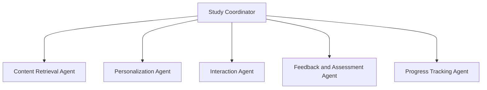

# Study and Learn Agent

## Overview

The Study and Learn Agent is a comprehensive AI-powered educational system that provides personalized and interactive learning experiences through specialized sub-agents. Each sub-agent focuses on a specific aspect of the learning process to deliver a thorough and engaging educational journey.

## Agent Details

| Attribute | Detail |
|---|---|
| Interaction Type | Conversational |
| Complexity | Medium |
| Agent Type | Multi Agent |
| Components | Sub-agents with specialized learning capabilities |
| Vertical | Education |

### Agent Architecture

The Study and Learn Agent uses a hierarchical multi-agent architecture:

- **Study Coordinator**: The root agent that orchestrates the entire learning process by delegating tasks to the specialized sub-agents.
- **Content Retrieval Agent**: Fetches relevant educational content based on user input or learning goals.
- **Personalization Agent**: Adapts content to the user's learning style, knowledge level, and preferences.
- **Interaction Agent**: Engages with the user through conversational learning, answering questions, and providing explanations.
- **Feedback and Assessment Agent**: Evaluates user responses to quizzes or exercises and provides constructive feedback.
- **Progress Tracking Agent**: Monitors and records the user's learning journey, updating their profile.



## Tools and APIs Used

Each sub-agent leverages specific tools to perform its analysis:

| Sub-Agent                | Tools Used         | Description |
|--------------------------|-------------------|-------------|
| Content Retrieval Agent  | Wikipedia Search  | Retrieves articles and summaries for learning. |
| Personalization Agent    | Memory            | Stores and retrieves user data for a personalized experience. |
| Interaction Agent        | Conversational Chain | Manages dialogue and provides clear explanations. |
| Feedback and Assessment Agent | Custom Scoring Logic | Evaluates user responses and provides feedback. |
| Progress Tracking Agent  | Memory            | Logs progress and updates the user's profile. |

## Features

- **Personalized Learning**: Adapts to individual user needs.
- **Interactive Q&A**: Engages users with questions and exercises.
- **Comprehensive Content**: Retrieves information from various sources.
- **Progress Tracking**: Monitors and visualizes the learning journey.
- **Modular Architecture**: Easily extendable with new agents and tools.

## Setup and Installation

### Prerequisites

- Python 3.12+
- Poetry for dependency management and packaging
  - See the official [Poetry website](https://python-poetry.org/docs/) for more information. To install Poetry run:
  ```bash
  pip install poetry
  ```
- Google Cloud Project with the following roles assigned:
  - Vertex AI User
  - Storage Admin
  - Service Usage Consumer
  - Logs Viewer

Once you have created your project, [install the Google Cloud SDK](https://cloud.google.com/sdk/docs/install). Then run the following command to authenticate:
```bash
gcloud auth login
```

You also need to enable certain APIs. Run the following command to enable:
```bash
gcloud services enable aiplatform.googleapis.com
```

## Agent Setup

1. Clone the repository:
   ```bash
   git clone <repository-url>
   cd study-agent
   ```

2. Install the dependencies:
   ```bash
   poetry install
   ```

3. Configure settings:
   - Set the following environment variables. You can set them in your `.env` file (modify and rename `.env.example` file to `.env`) or set them directly in your shell. For example:
   ```bash
   export GOOGLE_GENAI_USE_VERTEXAI=1
   export GOOGLE_CLOUD_PROJECT=my-project
   export GOOGLE_CLOUD_LOCATION=my-region
   ```

## Usage

Run the agent:
```bash
poetry run adk web
```

## Sample Workflow

This example demonstrates how a user request to "Teach me about photosynthesis" is processed through the multi-agent system.

1. **User Request**: The user asks the Study and Learn Agent to explain photosynthesis.

2. **Study Coordinator**: The coordinator receives the request and delegates the task to the appropriate sub-agent.
   - **Action**: Calls the `Content Retrieval Agent`.

3. **Content Retrieval Agent**: This agent searches for information on photosynthesis.
   - **Action**: Uses the Wikipedia Search tool to find a relevant article.
   - **Output**: Returns the raw text of the article to the coordinator.

4. **Personalization Agent**: The coordinator passes the content to this agent to tailor it to the user.
   - **Action**: Accesses the user's profile and learning history from memory to adapt the content.
   - **Output**: Returns a simplified and structured version of the article.

5. **Interaction Agent**: The coordinator sends the tailored content to this agent for user engagement.
   - **Action**: Presents the information in a conversational format and asks the user if they want to take a short quiz.

6. **Feedback and Assessment Agent**: If the user agrees to the quiz, this agent evaluates their answers.
   - **Action**: Scores the user's responses and generates personalized feedback.

7. **Progress Tracking Agent**: The coordinator sends the performance data to this agent to log the user's progress.
